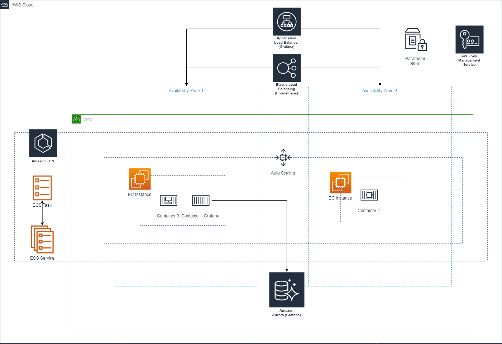
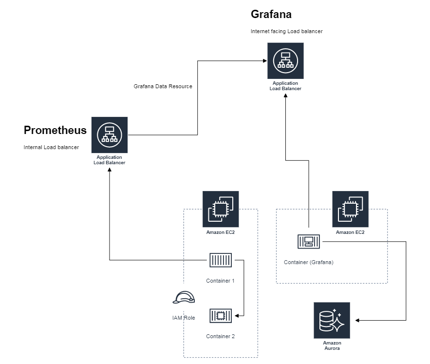

# Grafana on AWS ECS with Amazon Aurora Serverless database for persistent storage.

Deploying Grafana container service, on AWS ECS with high availability. Amazon Aurora Serverless database for storing dashboard, users, and other persistent data.

Deploying Prometheus Sever and Custom AWS Prometheus Expoter to export AWS API to Prometheus metrics.
This Python module allows you to run AWS API calls through Boto3, and expose the results of those calls as Prometheus metrics. Metrics must be described in YAML. 

Focsing on follwoing api.
- EC2 Information [ This to visualize AWS services running in an AWS account, using Grafana ]
- AWS Cost Explorer API [ This to visualize AWS services running in an AWS account, using Grafana ]


## What resources are created

1. VPC
2. Internet Gateway (IGW)
3. Public and Private Subnets
4. Security Groups, Route Tables and Route Table Associations
5. IAM roles, instance profiles and policies
6. Amazon EC2 Container Service ( On EC2 )
7. Grafana container service on ECS.
8. Prometheus Server and custom expoter containers to gather EC2 information and Cost Explorer api (every 24 hours)
9. Amazon Aurora Serverless ( for high availibilty )
10. Application Load balancer (Internet Facing) for Grafana service.
11. Application Load balancer (Internal) for Prometheus Server.
12. KMS Key
13. Parameter Store for store Database / Grafana Admin password

----

## How to use this example

## Pre-resuisite

1. Python v3.7
2. Terraform v0.11.14
3. AWS Account
4. IAM User With Admin Access


```bash
git clone git@github.com:nitinda/terraform_grafana_prometheus_on_ecs.git
cd terraform_grafana_prometheus_on_ecs
make plan
make apply
```


## Manual Steps post deployment (Optional)

```
- Configure Grafana to query Prometheus Server (Application Load balancer (Internal))

```

----

## Diagram




----

## Data Flow Diagram



----


## Other Information

Custom Docker Images
- https://github.com/nitinda/docker_prometheus_custom
- https://github.com/nitinda/docker_aws_api_prometheus_exporter


## Cleaning up

You can destroy this cluster entirely by running:

```bash
git clone git@github.com:nitinda/terraform_grafana_prometheus_on_ecs.git
cd terraform_grafana_prometheus_on_ecs
make plan
make destroy
```